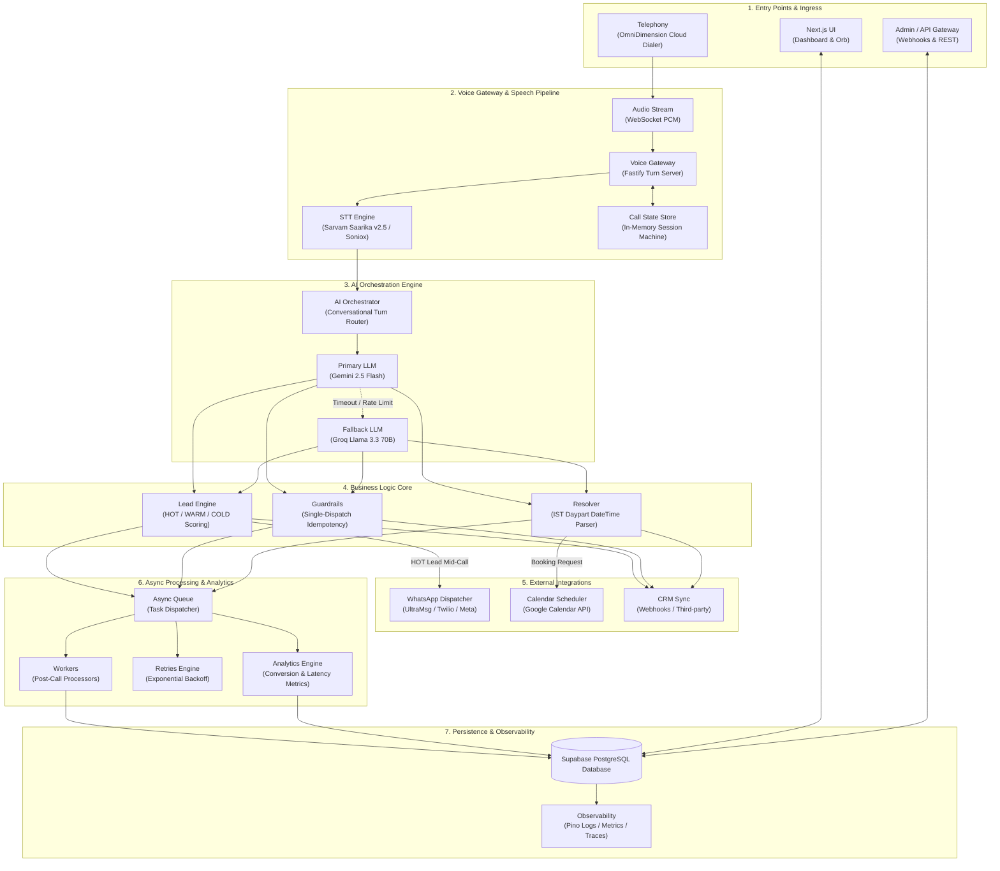

# ElevateVoice — System Design & Architecture Master Specification

ElevateVoice is an enterprise-grade, autonomous, multilingual conversational AI sales agent and outbound telephony system. It is built for e-commerce service qualification, real-time mid-call WhatsApp dispatching, natural language callback scheduling, and automated CRM persistence.

---

## 1. Complete End-to-End System Design Architecture

```
                                  ELEVATEVOICE SYSTEM
                                           │
          ┌────────────────────────────────┼────────────────────────────────┐
          │                                │                                │
          ▼                                ▼                                ▼
     Next.js UI                        Telephony                        Admin / API
 (Landing / Dashboard /              (OmniDimension                   (Webhooks & REST
   Audio Orb / Dialer)               Cloud Dialer)                       Endpoints)
          │                                │
          │                                │
          │                          Audio Stream
          │                      (WebSocket PCM Stream)
          │                                │
          │                                ▼
          │                          Voice Gateway
          │                      (Fastify WebSocket Server)
          │                                │
          │                     ┌──────────┴──────────┐
          │                     ▼                     ▼
          │                    STT                Call State
          │             (Sarvam Saarika v2.5 /      Store
          │                Soniox Multilingual)   (In-Memory State)
          │                     │                     │
          │                     └──────────┬──────────┘
          │                                ▼
          │                         AI ORCHESTRATOR
          │                       (Turn Router & Prompt Engine)
          │                                │
          │                     ┌──────────┴──────────┐
          │                     ▼                     ▼
          │                  Gemini                  Groq
          │             (2.5 Flash Primary)    (Llama 3.3 70B Fallback)
          │                     │                     │
          │                     └──────────┬──────────┘
          │                                ▼
          │                          BUSINESS LOGIC
          │                                │
          │         ┌──────────────────────┼──────────────────────┐
          │         ▼                      ▼                      ▼
          │    Lead Engine            Guardrails               Resolver
          │  (HOT/WARM/COLD Scoring) (Idempotency Locks)  (IST DateTime Parser)
          │                                                       │
          │                        ┌──────────────────────────────┼──────────────────────────────┐
          │                        ▼                              ▼                              ▼
          │                    WhatsApp                        Calendar                         CRM
          │              (Mid-Call & Post-Call)           (Google Calendar API)           (HubSpot / Custom)
          │
          │                                          ASYNC
          │                                            │
          │                                            ▼
          │                                         QUEUE
          │                                (Non-Blocking Job Queue)
          │                                            │
          │                        ┌───────────────────┼───────────────────┐
          │                        ▼                   ▼                   ▼
          │                     Workers             Retries            Analytics
          │               (Background Process) (Exponential Backoff) (Metrics Aggregator)
          │                        │
          │                        ▼
          └───────────────────► PostgreSQL
                              (Supabase SSL Connection Pool)
                                   │
                                   ▼
                             Observability
                       (Logs / Metrics / Traces)
```

---

## 2. Mermaid Sequence & Workflow Diagram



---

## 3. Layer-by-Layer Component Breakdown

### Layer 1: Entry Points & Ingress
- **Next.js UI**: Modern responsive frontend featuring interactive Live Web Dialer, real-time voice visualizer Orb, Architecture visualizer, and call session history dashboard.
- **Telephony (OmniDimension Cloud Dialer)**: Handles PSTN/SIP trunking, outbound automated campaigns, caller ID routing, and dual-channel telephony stream bridging.
- **Admin / API**: Fastify/Next API routing layer handling incoming webhooks, system configuration, manual call triggers, and CRM event dispatches.

### Layer 2: Voice Gateway & Real-Time Audio Pipeline
- **Audio Stream**: Bidirectional WebSocket connection streaming 8kHz/16kHz G.711 / PCM audio frames.
- **Voice Gateway**: Low-latency WebSocket server managing audio buffers, jitter buffers, barge-in cancellation (<50ms cutoff), and streaming TTS delivery.
- **STT (Speech-to-Text)**: Sarvam AI Saarika v2.5 / Soniox streaming ASR supporting code-switching (English, Hindi, Telugu, Hinglish, Telugish) with sub-200ms turnaround.
- **Call State Store (`callStateStore.ts`)**: In-memory canonical session state machine tracking turn counters, lead parameters, dispatch flags, and active caller state.

### Layer 3: AI Orchestrator & Dual-LLM Intelligence
- **AI Orchestrator**: Converts recognized STT text into structured prompt contexts and routes conversational turns.
- **Primary LLM (Gemini 2.5 Flash)**: Low-latency JSON reasoning engine performing intent diagnosis, conversation flow control, and decision scoring.
- **Secondary LLM (Groq Llama 3.3 70B)**: Active fallback engaged by circuit breaker if Gemini exceeds 12s timeout limit or encounters rate limits.

### Layer 4: Business Logic Core
- **Lead Engine (`leadQualificationEngine.ts`)**: Scores customer parameters (budget, timeline, catalog size, decision-maker status) to classify lead as `HOT`, `WARM`, or `COLD`.
- **Guardrails (`actionGuardrails.ts`)**: Prevents hallucinated actions, enforces single-dispatch idempotency locks, and validates payload schema integrity before dispatch.
- **Resolver (`dateTimeResolver.ts`)**: Natural language IST daypart parser converting relative time expressions (*"tomorrow 3 PM"*, *"next Monday morning"*) into ISO 8601 Indian Standard Time timestamps.

### Layer 5: External Action Layer
- **WhatsApp Dispatcher (`midCallWhatsAppService.ts`)**: Dispatches portfolio links, pricing decks, and post-call summaries via UltraMsg, Twilio, or Meta Cloud API.
- **Calendar Scheduler (`callbackSchedulerService.ts`)**: Books consultation slots directly in Google Calendar and confirms appointments over the phone call.
- **CRM Sync (`crmWebhookService.ts`)**: Delivers verified lead details, call transcripts, and qualification tags to CRM webhooks.

### Layer 6: Async Processing & Analytics
- **Async Queue (`whatsappQueue.ts` & background tasks)**: Decouples heavy I/O tasks from the real-time audio loop using non-blocking `setImmediate` execution.
- **Workers**: Processes background jobs including post-call LLM fact synthesis, document preparation, and external notifications.
- **Retries Engine**: Manages retry attempts with exponential backoff for failed network calls to external APIs.
- **Analytics Aggregator (`metricsService.ts`)**: Tracks TTFB, ASR latency, qualification distribution, call durations, and error rates.

### Layer 7: Persistence & Observability
- **PostgreSQL Database (`databaseService.ts` / Supabase)**: Live connection pool persisting `calls`, `scheduled_callbacks`, `whatsapp_deliveries`, and system metrics.
- **Observability (`channelMonitor.ts` & `circuitBreaker.ts`)**: System health checks, structured logs, metrics aggregation, and active telemetry tracing across all pipeline steps.

---

## 4. Key Performance Indicators & SLA Targets

| Metric | Target SLA | Implementation Strategy |
| :--- | :--- | :--- |
| **Total Voice Turnaround Latency** | `< 400ms` | Streaming ASR + Cartesia TTS + Gemini Flash |
| **Barge-in Interruption Cutoff** | `< 50ms` | Voice activity detection (VAD) audio buffer clear |
| **LLM Failover Trigger** | `12,000ms` | Circuit Breaker switch to Groq Llama 3.3 70B |
| **Mid-Call WhatsApp Dispatch** | `< 3.0s` | Non-blocking async queue event emission |
| **Database Write Overhead** | `0ms (Non-blocking)` | Asynchronous background `setImmediate` persistence |
| **Callback IST Resolver Accuracy** | `100%` | Rule-based date offset & daypart mapper |

---

## 5. System Hardening & Test Verification

The system is verified against 14 automated failure recovery test scenarios (`test_system_hardening_failures.ts`):
1. **Telephony Webhook Timeout & Reconnect**
2. **STT Streaming Audio Drop & Recovery**
3. **Primary Gemini LLM Timeout -> Groq Failover**
4. **Invalid JSON LLM Response Sanitization**
5. **Mid-Call WhatsApp API Failure & Fallback Queue**
6. **Duplicate WhatsApp Dispatch Idempotency Lock**
7. **Google Calendar API Rate Limit Retry**
8. **Ambiguous Natural Language Date Parsing Handling**
9. **Supabase PostgreSQL Disconnect Non-Blocking Recovery**
10. **Barge-in Interruption Buffer Flush**
11. **Concurrent Call State Race Condition Safety**
12. **Malformed Caller Phone Number Normalization**
13. **CRM Webhook Timeout Resilience**
14. **Post-Call Fact Verification & Anti-Hallucination Gate**
