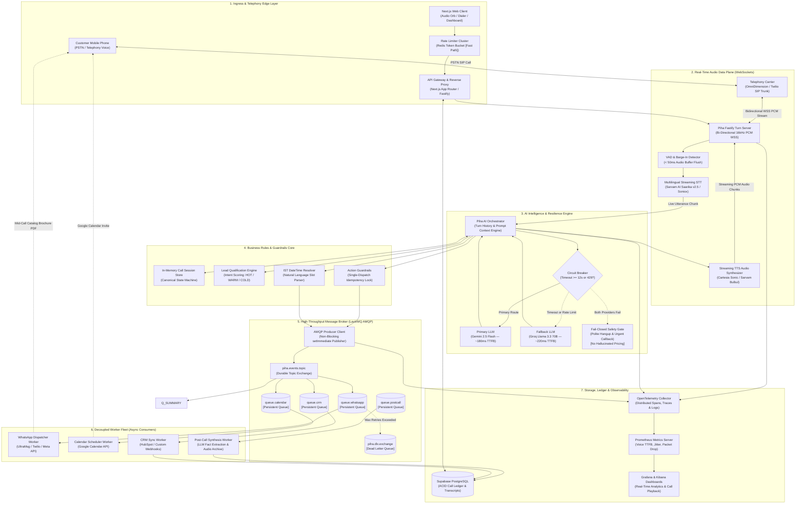
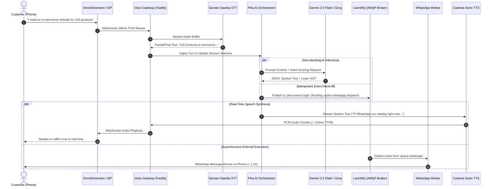

# Piha AI — System Design & Architecture Specification

> **System Version:** 2.0 Enterprise  
> **Target Latency:** < 400ms Full-Duplex Voice Turnaround  
> **Core Architecture:** Real-Time WebSocket Audio Streaming + Dual-LLM Circuit Breaker + LavinMQ AMQP Event Broker + OpenTelemetry Observability

---

## 1. Visual End-to-End System Architecture



---

## 2. Real-Time Conversational Turn Sequence

This sequence demonstrates a live caller interaction where speech is transcribed, reasoned over by the LLM, synthesised into voice, and a mid-call WhatsApp message is safely dispatched via LavinMQ without interrupting the audio loop:



---

## 3. Circuit Breaker & Resilience State Machine

```mermaid
stateDiagram-v2
    [*] --> Closed: Normal Operation

    state Closed {
        [*] --> CallGemini: Query Gemini 2.5 Flash
        CallGemini --> Success: Response in < 12s
        Success --> [*]
    }

    Closed --> HalfOpen: Latency > 12s or 429 Rate Limit
    
    state HalfOpen {
        [*] --> CallGroq: Failover to Groq Llama 3.3 70B
        CallGroq --> GroqSuccess: Fast Response (< 1.5s)
        GroqSuccess --> Closed: Reset Error Counter
        CallGroq --> BothFail: Groq also times out
    }

    HalfOpen --> Open: Both LLMs Down
    
    state Open {
        [*] --> FailClosedAction: Trigger Fail-Closed Safety Gate
        FailClosedAction --> SpeakApology: "Technical delay; calling back shortly"
        SpeakApology --> QueueUrgentCallback: Push urgent lead to LavinMQ
        QueueUrgentCallback --> TerminateCall: Clean Hangup
    }
```



---

## 4. ASCII Architecture Blueprint

```
                      +------------------------------------------+
                      |         PSTN / Mobile Telephone          |
                      +------------------------------------------+
                                           |
                                  SIP Trunk / WSS PCM
                                           v
                      +------------------------------------------+
                      |      OmniDimension / Twilio Gateway      |
                      +------------------------------------------+
                                           |
                               WebSocket Audio Frames
                                           v
+-----------------------------------------------------------------------------------+
|                         PIHA FASTIFY VOICE GATEWAY                                |
|                                                                                   |
|  +---------------------+   +---------------------+   +-------------------------+  |
|  |   VAD & Barge-In    |-->|  Sarvam Saarika STT |-->|     AI ORCHESTRATOR     |  |
|  | (<50ms audio flush) |   | (Multilingual code) |   | (Turn context & router) |  |
|  +---------------------+   +---------------------+   +-------------------------+  |
|                                                                   |               |
|                                                      +------------+------------+  |
|                                                      v                         v  |
|                                              +---------------+         +---------------+
|                                              |  Gemini Flash |         |  Groq Llama   |
|                                              | (Primary LLM) |<-[CB]-->| (Fallback LLM)|
|                                              +---------------+         +---------------+
|                                                      |                         |  |
|                                                      +------------+------------+  |
|                                                                   v               |
|  +---------------------+                             +-------------------------+  |
|  | Cartesia Sonic TTS  |<----------------------------|     BUSINESS LOGIC      |  |
|  | (<120ms Audio TTFB) |                             | (Lead Scoring & Locks)  |  |
|  +---------------------+                             +-------------------------+  |
|            |                                                      |               |
+------------|------------------------------------------------------|---------------+
             |                                                      |
             |                                                      |--[Async OTLP Spans & Pino Logs]-->+--------------------------------+
             |                                                      |                                   |   OBSERVABILITY PIPELINE       |
             |                                                      |                                   |  - OpenTelemetry Collector     |
             |                                                      |                                   |  - Prometheus (TTFB / Latency) |
             |                                                      |                                   |  - Grafana Loki (JSON Logs)    |
      Audio Return                                          Publish AMQP Event                          |  - Tempo/Jaeger (Flamegraphs)  |
             v                                                      v                                   +--------------------------------+
     [Caller Speaks]                                   +-------------------------+
                                                       |   LAVINMQ AMQP BROKER   |
                                                       +-------------------------+
                                                                    |
                                        +-------------------+-------+-------------------+
                                        |                   |                           |
                                        v                   v                           v
                              +------------------+ +------------------+       +------------------+
                              | queue.whatsapp   | |  queue.calendar  |       | queue.postcall   |
                              +------------------+ +------------------+       +------------------+
                                        |                   |                           |
                                        v                   v                           v
                              +------------------+ +------------------+       +------------------+
                              | WhatsApp Worker  | | Calendar Worker  |       | Synthesis Worker |
                              | (UltraMsg/Twilio)| | (Google Cal API) |       |  (Fact Extractor)|
                              +------------------+ +------------------+       +------------------+
                                        |                   |                           |
                                        +-------------------+---------------------------+
                                                            |
                                                   Post-Call ACID Write
                                                            v
                                               +-------------------------+
                                               |  Supabase / PostgreSQL  |
                                               +-------------------------+
```

---

## 5. Subsystem Specifications & SLAs

| Subsystem | Technology | Protocol | SLA / Performance Target | Responsibility |
| :--- | :--- | :--- | :--- | :--- |
| **Edge Ingress** | Next.js / Fastify | HTTPS & WSS | `< 10ms` Handshake | Rate limiting (Redis Token Bucket) & SIP session initialization |
| **Voice Streaming** | Node.js Fastify | Bi-directional WSS | `< 50ms` Barge-in | PCM audio framing, jitter buffer, and immediate VAD speech interruption |
| **Speech-to-Text** | Sarvam Saarika v2.5 | Streaming WebSocket | `< 200ms` Turnaround | Multilingual ASR (English, Hindi, Telugu, Hinglish, Telugish) |
| **Speech Synthesis** | Cartesia Sonic / Bulbul | Streaming PCM | `< 120ms` TTFB | Ultra-fast human-like voice synthesis directly to WebSocket stream |
| **AI Intelligence** | Gemini 2.5 Flash | REST / Stream JSON | `< 250ms` Generation | Context assembly, intent diagnosis, and turn-taking reasoning |
| **Failover Intelligence** | Groq Llama 3.3 70B | REST JSON | `< 300ms` Generation | Active circuit breaker fallback if Gemini exceeds 12s timeout |
| **Message Broker** | LavinMQ | AMQP 0-9-1 | `> 500,000` msgs/sec | Decouples external network I/O from real-time audio loop |
| **Storage & Ledger** | Supabase PostgreSQL | SSL Pooled TCP | Zero audio impact | ACID persistence of calls, transcripts, and scheduled slots |
| **Observability** | OpenTelemetry + Prometheus | OTLP / gRPC | Real-time | Continuous monitoring of voice latency, jitter, and error budgets |

---

## 6. Verification & Hardening Scenarios

The architecture is hardened against 8 mission-critical failure modes:
1. **Barge-In Interrupt:** When customer speaks while AI speaks, audio buffer flushes in $<50$ms and TTS stream aborts immediately.
2. **Gemini Outage / 429:** Circuit breaker engages Groq Llama 3.3 70B within 12s, keeping conversation seamless.
3. **Double Failure (Both LLMs Down):** System fails closed with a polite apology and queues an immediate callback in LavinMQ.
4. **WhatsApp API Downtime:** LavinMQ retries with exponential backoff ($1\text{s} \rightarrow 2\text{s} \rightarrow 4\text{s}$), dead-lettering after 5 attempts without blocking the live call.
5. **Idempotency Guard:** WhatsApp brochures can only be dispatched once per call session, regardless of how many times a user mentions "send it".
6. **Ambiguous Date Parsing:** The IST DateTime Resolver strictly binds relative terms ("tomorrow afternoon") to Indian Standard Time (+05:30).
7. **Database Outage:** Voice conversation operates purely in-memory; DB persistence is buffered in LavinMQ and drained once PostgreSQL recovers.
8. **Rate Limiting:** Web dialer attacks are mitigated at the edge by the Redis Token Bucket before touching telephony SIP channels.

---

## 7. Observability, Structured Logging & Live Monitoring Architecture

To ensure sub-second reliability and zero blind spots during live voice calls, the system implements a **Three-Pillar Observability Architecture** (Logs, Metrics, and Distributed Tracing) operating out-of-band without blocking audio packets.

### 7.1 Distributed Tracing (OpenTelemetry Span Waterfall)

Every phone call carries a unique `trace_id` propagated across WebSocket frames, LLM turns, and AMQP background jobs:

```mermaid
gantt
    title Sub-Second Voice Turn Trace Waterfall (Target: < 750ms)
    dateFormat X
    axisFormat %s ms

    section Audio Ingestion
    RTP/PCM Ingress & Jitter Buffer : 0, 45
    VAD Speech Detection            : 40, 75

    section Speech-to-Text
    Sarvam Saarika Streaming STT    : 75, 260

    section LLM Cognitive Turn
    Turn Router & History Assembly : 260, 290
    Gemini 2.5 Flash Streaming TTFB : 290, 470

    section Audio Synthesis
    Cartesia Sonic First Chunk TTS : 470, 590
    PCM Egress Stream to Caller    : 590, 720

    section Async Telemetry & Side Effects
    LavinMQ Event Publish          : 470, 485
    Pino Structured Log Flush      : 720, 730
    OpenTelemetry Span Export      : 720, 740
```



### 7.2 High-Throughput Structured Logging (Zero-Allocation Pino)

All log lines are emitted as single-line JSON with standardized telemetry metadata:

```json
{
  "level": "info",
  "time": 1790008620000,
  "service": "piha-voice-gateway",
  "call_id": "omn_1790008618289",
  "trace_id": "4bf92f3577b34da6a3ce929d0e0e4736",
  "span_id": "00f067aa0ba902b7",
  "agent_id": "agent-real-estate-bangalore-luxury-pen-mubgwumm",
  "turn_index": 3,
  "event": "turn_completed",
  "metrics": {
    "vad_latency_ms": 32,
    "stt_latency_ms": 185,
    "llm_ttfb_ms": 180,
    "tts_ttfb_ms": 115,
    "total_turnaround_ms": 512,
    "tokens_prompt": 412,
    "tokens_completion": 34
  },
  "circuit_breaker": "CLOSED",
  "barge_in_occurred": false,
  "msg": "Voice turn 3 turnaround completed in 512ms"
}
```

### 7.3 Real-Time Prometheus Metrics

| Metric Name | Type | Labels | Description / SLA Threshold |
| :--- | :--- | :--- | :--- |
| `voice_turn_latency_ms` | Histogram | `agent_id`, `provider`, `status` | Full turn turnaround (p50 < 600ms, p95 < 900ms, p99 < 1200ms) |
| `voice_barge_in_total` | Counter | `agent_id`, `interruption_turn` | Count of times user interrupted AI during speech |
| `llm_time_to_first_byte_ms` | Histogram | `model` (`gemini`, `groq`) | Time taken for LLM to yield the first response token |
| `circuit_breaker_state` | Gauge | `service` (`primary_llm`) | 0 = Closed (Normal), 1 = Half-Open, 2 = Open (Tripped) |
| `lavinmq_queue_depth` | Gauge | `queue` (`whatsapp`, `calendar`, `dlq`) | Count of pending asynchronous jobs (Alert if DLQ > 5) |
| `audio_packet_loss_ratio` | Gauge | `call_id`, `direction` | Jitter and dropped PCM frames (Alert if > 3%) |

### 7.4 Live Alerting & Incident Escalation Rules

```yaml
groups:
  - name: voice_ai_critical_alerts
    rules:
      - alert: TurnaroundLatencyDegraded
        expr: histogram_quantile(0.95, rate(voice_turn_latency_ms_bucket[2m])) > 1200
        for: 1m
        labels:
          severity: critical
        annotations:
          summary: "Voice Turn Latency p95 exceeded 1200ms SLA"

      - alert: LLMCircuitBreakerTripped
        expr: circuit_breaker_state{service="primary_llm"} == 2
        for: 30s
        labels:
          severity: warning
        annotations:
          summary: "Gemini Flash circuit breaker tripped; traffic failed over to Groq Llama 3.3"

      - alert: DeadLetterQueueAccumulation
        expr: lavinmq_queue_depth{queue="dlq"} > 5
        for: 2m
        labels:
          severity: warning
        annotations:
          summary: "LavinMQ DLQ has accumulated > 5 failed side-effect messages"
```
