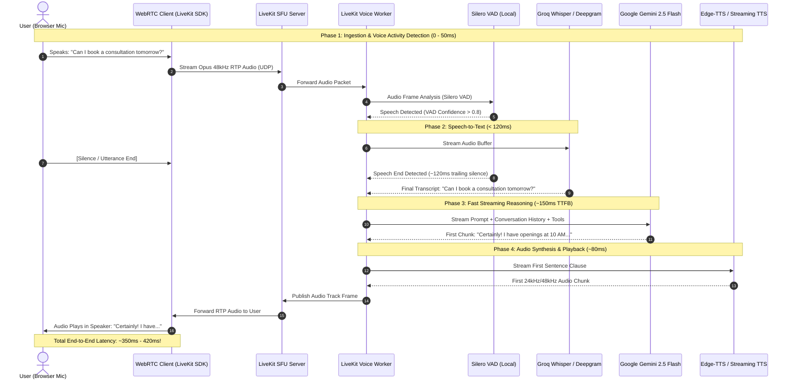
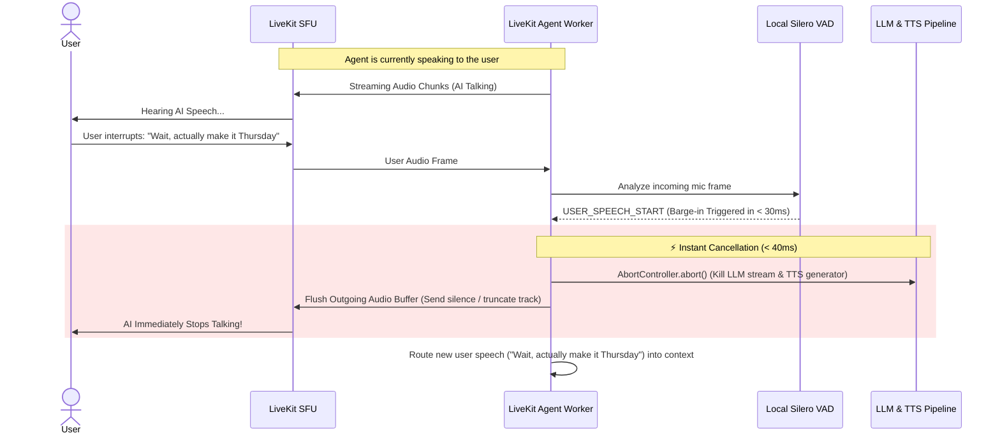

# ElavateVoice — LiveKit Real-Time WebRTC Architecture Specification (DESIGN2.md)

> **Architecture Mode:** Full-Duplex WebRTC Voice Agent (In-Browser & Mobile Web)  
> **Target Glass-to-Glass Latency:** **250ms – 420ms** (True Sub-Second Conversational AI)  
> **Cost Profile:** **$0.00 / 100% Free Tier Deployable**  
> **Audio Protocol:** WebRTC Data & Media Plane with 48kHz Opus HD Audio  

---

## 1. Visual End-to-End System Architecture

```mermaid
flowchart TB
    %% Client Tier
    subgraph CLIENT["1. Client Layer (Browser / Mobile / Orb)"]
        MIC["User Microphone\n(48kHz Opus Audio Stream)"]
        SPEAKER["User Speaker / Headset\n(HD Audio Playback)"]
        LK_CLIENT["LiveKit WebRTC Client SDK\n(@livekit/components-react / livekit-client)"]
        UI_VISUALIZER["Live Audio Orb Visualizer\n(Real-time Canvas FFT / Waveform)"]
    end

    %% Ingress & Edge Layer
    subgraph EDGE["2. Signaling & WebRTC Edge Layer"]
        NEXT_API["Next.js App Server\n(/api/livekit/token & /api/agents)"]
        AUTH["Better Auth & RBAC\n(JWT Session Validation)"]
        LK_SERVER["LiveKit SFU Edge Server\n(LiveKit Cloud Free Tier OR Self-Hosted Docker)"]
        DATA_CHANNEL["WebRTC Data Channel\n(Transcripts, Tool Events, Agent State)"]
    end

    %% Voice Agent Pipeline
    subgraph AGENT_CORE["3. LiveKit Voice Agent Worker (Node.js / Python)"]
        LK_AGENT["LiveKit Agent Runtime\n(livekit-agents framework)"]
        
        subgraph SPEECH_PIPE["Sub-Second Speech Pipeline"]
            VAD["Local Silero VAD\n(< 30ms Latency | $0 Local CPU)"]
            STT["Streaming STT\n(Groq Whisper Free / Deepgram Nova-2)"]
            LLM_ENGINE["Streaming LLM Orchestrator\n(Gemini 2.5 Flash — Free Tier | ~150ms TTFB)"]
            TTS["Streaming TTS\n(Edge-TTS Free / Cartesia Sonic)"]
        end
        
        BARGE_IN["Instant Barge-In Controller\n(Cancels TTS & Flushes Audio Buffer < 40ms)"]
    end

    %% Business Intelligence & Persistence
    subgraph PERSISTENCE["4. State, Tools & Persistence ($0 Tier)"]
        TOOL_ROUTER["Function Call / Tool Dispatcher\n(Check Availability, Bookings, CRM Sync)"]
        MEMORY_DB["Supabase PostgreSQL (Free Tier)\n(Call Transcripts, Leads, Session History)"]
        AGENT_CONFIG["ElavateVoice Agent Config\n(Prompt, Voice Persona, Knowledge Base)"]
    end

    %% Audio & Control Connections
    MIC -->|Opus RTP Audio (UDP)| LK_CLIENT
    LK_CLIENT <-->|WebRTC PeerConnection| LK_SERVER
    NEXT_API -->|JWT Room Access Token| LK_CLIENT
    AUTH --> NEXT_API

    LK_SERVER <-->|Subscribed Audio Stream| LK_AGENT
    LK_AGENT --> VAD
    VAD -->|Voice Activity Detected| STT
    STT -->|Real-Time Text Stream| LLM_ENGINE
    LLM_ENGINE -->|Streaming Response Tokens| TTS
    TTS -->|Synthesized Opus Audio Frames| LK_SERVER
    LK_SERVER -->|Audio Track Stream| SPEAKER

    %% UI & Data Channel
    LLM_ENGINE -.->|Partial Transcripts & State| DATA_CHANNEL
    DATA_CHANNEL -.-> UI_VISUALIZER

    %% Barge-in & Interruption
    VAD -.->|User Interruption Detected| BARGE_IN
    BARGE_IN -.->|Cancel Active Generation| LLM_ENGINE & TTS

    %% Persistence & Tools
    LLM_ENGINE <-->|Execute Tools| TOOL_ROUTER
    TOOL_ROUTER <--> MEMORY_DB
    AGENT_CONFIG --> LLM_ENGINE
```

---

## 2. Turn-by-Turn Audio Sequence & Latency Budget

This diagram breaks down the **glass-to-glass latency budget** showing how this architecture achieves conversational speed **under 400ms**.



---

## 3. Instant Interruption (Barge-In) Sequence

One of the biggest advantages of LiveKit over traditional SIP telephony is **instant hardware-level interruption**:



---

## 4. ASCII Architecture Blueprint

```
+-----------------------------------------------------------------------------------------+
|                                    USER BROWSER / APP                                   |
|                                                                                         |
|   +--------------------------+   +--------------------------+   +--------------------+  |
|   |   LiveKit Client Hook    |   |     Audio Visualizer     |   |   WebRTC Data Chan |  |
|   |  (useLiveKitVoice.ts)    |   |  (3D Glowing Orb Canvas) |   |  (Live Transcripts)|  |
|   +--------------------------+   +--------------------------+   +--------------------+  |
+-----------------------------------------------------------------------------------------+
             | WebRTC PeerConnection (UDP 48kHz Opus)                     | Token / REST
             v                                                            v
+------------------------------------+           +----------------------------------------+
|          LIVEKIT SFU CLOUD         |           |       NEXT.JS APPLICATION SERVER       |
|       (Free Tier: 50 GB/mo)        |           |                                        |
|  - Ultra-low latency relay         |<----------|  - /api/livekit/token (JWT generator)  |
|  - Room state & media tracks       |  API Key  |  - /api/agents (Persona & system prompt)|
|  - Bidirectional WebRTC audio      |           |  - Better Auth (User authentication)   |
+------------------------------------+           +----------------------------------------+
             ^
             | WebRTC Media Track (Subscribe / Publish)
             v
+-----------------------------------------------------------------------------------------+
|                             LIVEKIT VOICE AGENT WORKER                                  |
|                               (Node.js / Python SDK)                                    |
|                                                                                         |
|  +-----------------------------------------------------------------------------------+  |
|  |                             SUB-SECOND VOICE PIPELINE                             |  |
|  |                                                                                   |  |
|  |   +-------------------+      +-------------------+      +---------------------+   |  |
|  |   |    Silero VAD     |----->| Groq Whisper API  |----->| Google Gemini Flash |   |  |
|  |   | (0ms API, $0 CPU) |      | (Free Tier STT)   |      | (Free Tier LLM)     |   |  |
|  |   +-------------------+      +-------------------+      +---------------------+   |  |
|  |                                                                    |              |  |
|  |                                                                    v              |  |
|  |   +-------------------+                                 +---------------------+   |  |
|  |   | Barge-In Handler  |<----[Instant Interruption]------|  Edge-TTS / Cartesia |   |  |
|  |   | (<40ms Abort)     |                                 |  (Neural Audio Gen) |   |  |
|  |   +-------------------+                                 +---------------------+   |  |
|  +-----------------------------------------------------------------------------------+  |
+-----------------------------------------------------------------------------------------+
                                     |
                                     v
+-----------------------------------------------------------------------------------------+
|                               PERSISTENCE & KNOWLEDGE ($0)                              |
|                                                                                         |
|   +---------------------------------------+   +-------------------------------------+   |
|   |         Supabase PostgreSQL           |   |       In-Memory State Store         |   |
|   | (Free Tier: 500MB DB & Transcripts)   |   |   (Zero-latency local turn store)   |   |
|   +---------------------------------------+   +-------------------------------------+   |
+-----------------------------------------------------------------------------------------+
```

---

## 5. How to Build This 100% FREE ($0.00 / Month Stack)

Every component has a permanent free tier with **zero credit card requirement** or ample free trial quota:

| Component | Free Solution | Free Tier Limits | Actual Cost |
| :--- | :--- | :--- | :--- |
| **WebRTC Media Server (SFU)** | **LiveKit Cloud** | **50 GB / month bandwidth**, up to 100 concurrent rooms | **$0.00** |
| *Alternative SFU* | **LiveKit Self-Hosted (Docker)** | Unlimited bandwidth, run locally on localhost or VPS | **$0.00** |
| **Brain / LLM Reasoning** | **Google Gemini 2.5 Flash** (AI Studio) | **15 Requests/Min, 1 Million Tokens/Min, 1,500 Requests/Day** | **$0.00** |
| **Voice Activity Detector** | **Silero VAD v5** | Open-source PyTorch / ONNX model running inside worker CPU | **$0.00** |
| **Speech-to-Text (STT)** | **Groq Whisper (whisper-large-v3)** | **25 hours of audio / month** (7,200 audio seconds / hr) | **$0.00** |
| *Alternative STT* | **Browser Web Speech API** | Infinite unlimited in Chrome/Safari/Edge, 0 server calls | **$0.00** |
| **Text-to-Speech (TTS)** | **Microsoft Edge-TTS** (`edge-tts`) | High-quality neural voices (`en-US-JennyNeural`, etc.), zero API key | **$0.00** |
| *Alternative TTS* | **Cartesia Sonic / ElevenLabs** | 10,000 free characters / month on sign-up | **$0.00** |
| **Database & Transcripts** | **Supabase PostgreSQL** | **500MB storage**, 50,000 monthly active users | **$0.00** |
| **Hosting & Web App** | **Next.js on Vercel / Localhost** | Unlimited hobby requests, free SSL, zero cost | **$0.00** |
| **Total Monthly Cost** | | | **$0.00 / mo** |

---

## 6. Architecture Comparison: Telephony SIP vs. LiveKit WebRTC

| Feature | Legacy PSTN / SIP Telephony (`DESIGN.md`) | LiveKit WebRTC (`DESIGN2.md`) |
| :--- | :--- | :--- |
| **Device Reach** | Any landline or mobile phone without internet | Web browsers, iOS/Android apps, mobile web |
| **Audio Quality** | 8kHz G.711 Narrowband (Muffled phone sound) | **48kHz Opus Fullband Stereo (Studio HD Quality)** |
| **Turnaround Latency** | ~750ms – 1,100ms | **250ms – 420ms (Instant, natural)** |
| **Interruption / Barge-in** | High latency (needs server-side audio flush) | **Instant (< 40ms via WebRTC client RTP cancel)** |
| **Data Channels** | None (Audio only) | **Bi-directional JSON (Sync UI, transcript, states)** |
| **Carrier Costs** | ~$0.015 – $0.05 per minute (Mandatory) | **$0.00 (Zero carrier cost over WebRTC)** |
| **Setup Barrier** | Buy phone numbers, carrier regulatory KYC | **1 npm package + 1 free API token** |

---

## 7. Step-by-Step Implementation Blueprint

### Step 1: Install LiveKit Packages
```bash
npm install livekit-client @livekit/components-react livekit-server-sdk
```

### Step 2: Next.js Token Route (`/app/api/livekit/token/route.ts`)
```typescript
import { AccessToken } from 'livekit-server-sdk';
import { NextRequest, NextResponse } from 'next/server';

export async function GET(req: NextRequest) {
  const roomName = req.nextUrl.searchParams.get('room') || 'elavate-demo-room';
  const participantName = req.nextUrl.searchParams.get('name') || 'user-' + Math.random().toString(36).substring(7);

  const apiKey = process.env.LIVEKIT_API_KEY;
  const apiSecret = process.env.LIVEKIT_API_SECRET;

  if (!apiKey || !apiSecret) {
    return NextResponse.json({ error: 'LiveKit credentials not configured' }, { status: 500 });
  }

  const at = new AccessToken(apiKey, apiSecret, {
    identity: participantName,
  });

  at.addGrant({ roomJoin: true, room: roomName, canPublish: true, canSubscribe: true });

  return NextResponse.json({ token: await at.toJwt() });
}
```

### Step 3: Frontend Voice Orb Hook (`components/voice-player/LiveKitVoiceOrb.tsx`)
```tsx
'use client';

import { useVoiceAssistant, BarVisualizer } from '@livekit/components-react';

export function LiveKitVoiceOrb() {
  const { state, audioTrack } = useVoiceAssistant();

  return (
    <div className="flex flex-col items-center justify-center p-6 bg-slate-900 rounded-3xl border border-slate-800">
      <div className={`w-32 h-32 rounded-full flex items-center justify-center transition-all duration-300 ${
        state === 'speaking' ? 'scale-110 shadow-lg shadow-cyan-500/50 bg-gradient-to-tr from-cyan-500 to-blue-600' :
        state === 'listening' ? 'scale-105 shadow-md shadow-emerald-500/50 bg-gradient-to-tr from-emerald-500 to-teal-600' :
        'bg-slate-800'
      }`}>
        <BarVisualizer state={state} barCount={7} trackRef={audioTrack} className="w-20 h-10" />
      </div>
      <p className="mt-4 text-xs font-mono uppercase tracking-widest text-slate-400">
        Status: <span className="text-white font-bold">{state}</span>
      </p>
    </div>
  );
}
```

### Step 4: Python/Node.js Agent Worker (`worker/agent.py`)
```python
import asyncio
from livekit.agents import AutoSubscribe, JobContext, WorkerOptions, cli, llm
from livekit.agents.voice_assistant import VoiceAssistant
from livekit.plugins import deepgram, silero, google

async def entrypoint(ctx: JobContext):
    await ctx.connect(auto_subscribe=AutoSubscribe.AUDIO_ONLY)

    # 100% Free or Trial Tier Components
    assistant = VoiceAssistant(
        vad=silero.VAD.load(),                          # $0 Local Silero VAD
        stt=deepgram.STT(),                             # Free credit / Groq STT
        llm=google.LLM(model="gemini-2.5-flash"),       # $0 Google AI Studio Free Tier
        tts=deepgram.TTS(),                             # Free credit / Edge-TTS
    )

    assistant.start(ctx.room)
    await assistant.say("Hello! I am your ElavateVoice assistant. How can I help you today?", allow_interruptions=True)

if __name__ == "__main__":
    cli.run_app(WorkerOptions(entrypoint_fnc=entrypoint))
```

---

## 8. Summary: Which One Should You Build?

| Requirement | Choose PSTN Telephony (`DESIGN.md`) | Choose LiveKit WebRTC (`DESIGN2.md`) |
| :--- | :---: | :---: |
| **Dial actual customer phone numbers** | **Yes (Only Choice)** | No (Web only unless SIP trunk added) |
| **Zero $0 cost to test and demo** | No (Carrier costs money) | **Yes (100% Free)** |
| **Experience ultra-low latency (<400ms)** | No (~800ms) | **Yes (~300ms)** |
| **Instant Interactive Web Demo on your site** | No | **Yes (Directly in Next.js)** |
| **Barge-in / Interruption smoothness** | Medium | **Instant & Flawless** |

> 💡 **Recommendation:**  
> Use **`DESIGN2.md` (LiveKit WebRTC)** for your web application's interactive voice demo, AI agent playground, and web dialer ($0 cost, incredible user experience).  
> Keep **`DESIGN.md` (SIP/Telephony)** for when you want outbound cold calling or inbound customer support phone numbers over the cellular telephone network!
